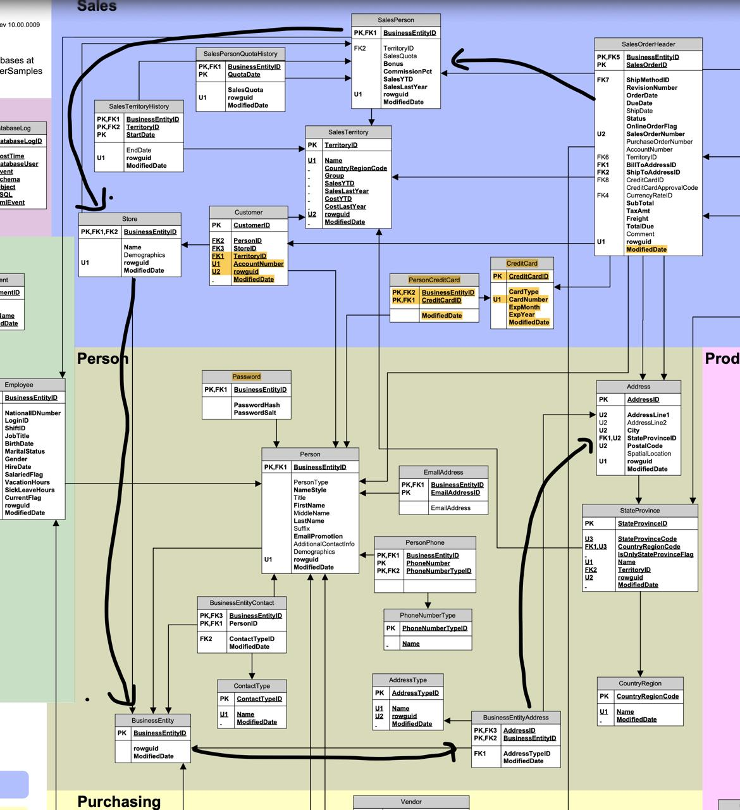

# Research Report: [Your Title Here]

**Date:** March 2026  
**Course:** Managing Relational and Non-relational Databases
**Institution:** NOVA Information Management School

| #ID | Name | Contact |
| :--- | :--- | :--- |
| xxx | Fiifi Nyarko-Mensah |  |
| yyy | Luis Alcaide |  |
| 20251702 | Davide Corbo |  |
| 20251105 | Backend Lead | 20251105@novaims.unl.pt |

## Abstract

This report details the design and implementation of a solution for business problems identified at AdventureWorks. The first objective addresses the requirement for a bidding system aimed at offloading old bicycle stocks. Utilizing T-SQL scripts compatible with SQL Server 2025, a series of idempotent DDL (Data Definition Language) and DML (Data Manipulation Language) scripts were engineered to serve as the database layer of the bidding system. The solution ensures structural integrity and re-runnability across local SQL Server and Azure SQL Database environments.

The primary focus of this study, however, is a data-driven analysis to identify optimal locations for AdventureWorks' entry into the brick-and-mortar retail sector. To avoid competition with existing top retailers of fthe company, the expansion strategy mandates the selection of two U.S. cities that do not compete with any of AdventureWorks' existing top 30 US retailers.

---

## 1. Introduction

Introduce the research topic and provide context and background information. Present the research problem, significance, and objectives. State the main research questions and hypotheses.

AdventureWorks Relational SQL Server Database Diagram:



---

## 2. Literature Review

Review relevant previous studies and theoretical frameworks. Synthesize existing knowledge and identify gaps in the literature. Discuss key findings from prior research that inform your work.

---

## 3. Methodology

Explain the research design, data collection methods, and analytical approaches. Describe the population/sample, instruments used, and procedures followed. Include information about any databases or systems utilized.

### 3.1 Data Sources

Detail the data sources and collection processes.

### 3.2 Analysis Methods

Describe the analytical techniques employed.

```sql
SELECT @@VERSION;
```

---

## 4. Results

### 4A Online Bidding System

Present findings from the research. Use tables and figures to highlight key data and trends.

### Table 1: Summary Statistics

| Metric | Value | Percentage |
|--------|-------|-----------|
| Sample Size | 250 | 100% |
| Response Rate | 187 | 74.8% |
| Completion Rate | 175 | 70% |
| Invalid Responses | 12 | 4.8% |

### Figure 1: Key Findings Distribution

[Insert figure/chart here - Example: A bar chart showing distribution of results across categories]

```
Example placeholder for image:

```

### 4B Brick and Mortar

The solution to the Brick and Mortar problem is broken down as follows:

```
We consider only the SubTotal amount in the SalesOrderHeader table, ignoring the sales tax components.
```

1. Identify the Top 30 US Retailers, across all cities in the USA
1. Identify `ALL` the cities in the USA where these Top 30 retailers have a presence.
1. Exclude these cities in the following calculations
1. Calculate the top cities by revenue, merging the individual customer data with the remaining retailer customers.

---

## 5. Discussion

Interpret the results in the context of the research questions and existing literature. Address the implications of findings, limitations of the study, and suggestions for future research. Compare your results with previous studies and explain any discrepancies.

---

## 6. Conclusion

Summarize the main findings and their significance. Restate how the research addresses the initial research questions. Discuss practical implications and recommendations for future work.

---

## 7. References

Agarwal, R., & Dhar, V. (2014). Big data, data science, and analytics for managing operational risk. *Journal of Electronic Commerce Research*, 8(2), 15-28.

Codd, E. F. (1970). A relational model of data for large shared data banks. *Communications of the ACM*, 13(6), 377-387.

Date, C. J. (2003). *An introduction to database systems* (8th ed.). Addison-Wesley.

Elmasri, R., & Navathe, S. B. (2010). *Fundamentals of database systems* (6th ed.). Pearson Education.

Garcia-Molina, H., Ullman, J. D., & Widom, J. (2008). *Database systems: The complete book* (2nd ed.). Prentice Hall.

Stonebraker, M., & Ilyas, I. F. (2013). Towards a vision of real-time big data. *IEEE Data Engineering Bulletin*, 36(4), 52-59.

Vassiliadis, P., Simitsis, A., & Georgantas, P. (2009). A framework for designing ETL processes. *ACM SIGMOD Record*, 38(1), 67-77.

---

## Appendix

### A. Supplementary Tables

Additional data and detailed tables can be included here.
